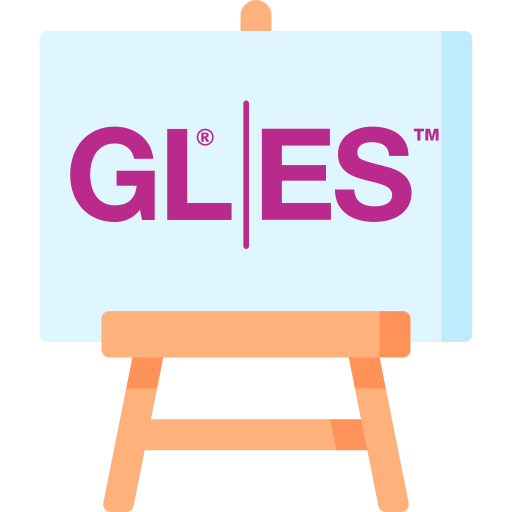

#  ComposeGL

This library adds a `GLCanvas` composable which allows high-performance 2D and 3D rendering within any  
Compose Multiplatform application.  
It also provides a lightweight abstraction to access GLES and Desktop GL using a common API up to GLES 3.0.

### Platform support

|                     | Android  | iOS      | macOS           | Windows         | Linux           | Web      |
|---------------------|----------|----------|-----------------|-----------------|-----------------|----------|
| **API Level**       | GLES 3.2 | GLES 3.0 | GL 4.1/GLES 2.0 | GL 4.6/GLES 2.0 | GL 4.6/GLES 2.0 | GLES 3.0 |
| **Backend**         | GLES     | ANGLE    | Desktop GL      | Desktop GL      | Desktop GL      | ANGLE    |
| **\*Skiko Backend** | GLES     | Metal    | Desktop GL      | Desktop GL      | Desktop GL      | GLES     |

**\*In order to guarantee proper interoperability, ComposeGL forces Compose to use  
the specified Skiko backend on the respective platforms.**

The common API level as of the last time updating this table is **GLES 2.0**,   
which is available on all listed platforms without exceptions.  

GLES 3.X support is planned once ANGLE finishes their implementation, which  
allows using GLES 3.2 on iOS and Web.

### How to use it

```kotlin
// Make sure to call ComposeGL.setup() before
// initializing the main view of your App.

@Composable
fun MyApp() {
    GLCanvas(
        onDispose = { /* Callback when canvas is disposed */ },
        fallbackContent = { Text("ComposeGL is not supported") }
    ) {
        val shader = memoize { GLShader(...) }
        glClearColor(0F, 0F, 0F, 1F)
        glClear(GL_COLOR_BUFFER_BIT)
        shader.use {
            // Your rendering code here
        }
    }
}
```